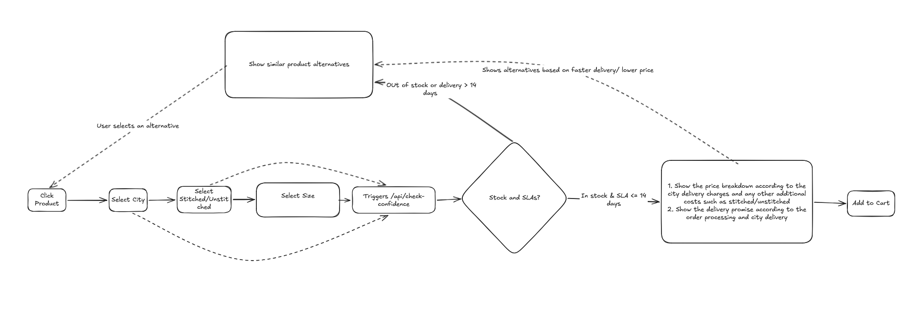

# LAAM: Product Discovery and Purchase Confidence

## 1. Problem Understanding

This is a decision-confidence problem, not a discovery problem. The customer already likes the product, they just don't trust that it'll actually work out for them (right size, on time, real price).

**From customer POV:** reduce their cognitive load so they can decide fast.
**From business POV:** keep them on site and get them to purchase instead of dropping off.

Out of the pain points listed, I focused on **delivery trust + configuration-aware availability** (unstitched vs stitched) and city delivery time. "In stock" doesn't mean much in this space if the configuration you want still needs 3 weeks to stitch. A vague "ships in 2-4 weeks" is exactly where drop-off happens, especially for time-sensitive stuff like weddings.

One thing I thought through before jumping to a solution: what happens when a customer's size isn't available?
- if we grey it out, they just leave, and we lose all context on what they actually wanted
- if we keep it clickable, the click itself tells us their intent, and we can use that to surface alternatives right there instead of losing them silently

So I kept sizes clickable even when unavailable, and used that as the trigger for showing alternatives, ranked by delivery speed, not price, since speed is what actually solves their anxiety.

**AI usage:** used AI to check whether alternatives should be shown when the product is available. It pointed to how big marketplaces (Alibaba etc.) usually rank by fulfillment speed for time-sensitive categories, which confirmed the call.

---

## 2. Scope

**Built:**
- One product page with city, stitched/unstitched, and size as live controls affecting price/delivery
- Real-time re-evaluation on any control change (no page reload)
- Upfront itemized price breakdown (base + stitching + shipping = total)
- Delivery ETA = processing lead time + city transit time, checked against a 14-day SLA
- Alternatives shown in two cases: size out of stock (same-size ready-to-ship options), or size available but slower/pricier (faster/cheaper shelf below CTA)
- Clicking an alternative swaps it in as the main product
- Backend split into layers (routes / service / repository / mock data)
- 4 backend integration tests

**Not built, and why:**
- Catalog/search — out of scope, happens before this feature
- Cart/checkout — this ends at "confident to proceed," not conversion
- Auth/login — session-based context is sufficient
- Real database — in-memory mock, time spent on logic instead of infra

---

## 3. User Flow



---

## 4. Technical Approach

### Frontend
- React 18 + Vite, Tailwind + CSS tokens
- `App.jsx` — root state, holds `currentProduct`
- `ProductOverview.jsx` — image gallery
- `ConfidenceChecker.jsx` — city/finish/size controls, auto-refetch on change
- `ConfidenceResult.jsx` — stock status, price breakdown, delivery date, alternatives
- `AlternativeCard.jsx` — swaps PDP state on click
- `SizeSelector.jsx`, `SegmentedToggle.jsx` — reusable inputs

### Backend
- FastAPI, Python 3.12, Pydantic v2 — 3-layer structure
- `main.py` — routes, CORS, error → HTTP status mapping (`ProductNotFoundError` → 404, `InvalidSizeError` → 400)
- `service.py` — `PurchaseConfidenceService`: SLA rules, price math, alternative ranking
- `repository.py` — data access + response schemas
- `mock_db.py` — in-memory product/stock/lead-time/shipping data

### Data Model

```json
{
  "status": "available",
  "message": "Available in size S. Guaranteed delivery by July 30.",
  "price": {
    "base_price": 128000,
    "stitching_fee": 15000,
    "shipping_fee": 500,
    "total": 143500
  },
  "delivery_days": 8,
  "alternatives": [
    {
      "id": 4,
      "name": "Dusty Rose Bridal Gharara",
      "image_url": "/images/product-4.png",
      "price": 98000,
      "delivery_days": 6
    }
  ]
}
```

### Key Decisions
- Delivery ETA is computed (lead time + transit time vs 14-day SLA), not a static string
- Price shown as itemized breakdown, not a flat number, so the total is explainable
- Alternatives ranked by delivery speed first, never block the direct Add to Cart path
- Any control change (city/finish/size) re-triggers the confidence check, not just size

### Assumptions
- Delivery cost/time fixed per city, not from a live courier API
- Lead time per configuration is stored, not vendor-sourced
- One vendor per product (no multi-vendor split stock)
- Single currency (PKR)

---

## 5. How to Run

### Prerequisites
- Python 3.10+, Node.js 18+

### Backend
```bash
cd backend
python3 -m venv .venv
source .venv/bin/activate
pip install -r requirements.txt
uvicorn main:app --reload --host 0.0.0.0 --port 8000
```
Runs at `http://localhost:8000` (docs at `/docs`)

### Frontend
```bash
cd frontend
npm install
npm run dev
```
Runs at `http://localhost:5175` (or Vite-assigned port)

---

## 6. Tests

`backend/test_confidence_api.py` — 4 integration tests:
1. Available product → itemized price + delivery date
2. Out-of-stock → alternatives returned
3. Invalid product → 404
4. Invalid size → 400

```bash
cd backend && pytest test_confidence_api.py
```
`4 passed in 0.64s`

---

## 7. Tradeoffs

- In-memory data over a real DB — no persistence/concurrency, fine for a demo
- Single vendor per product — true multi-vendor stock modeling would've taken most of the time budget alone
- Fixed city list/delivery charges — not real courier complexity (weight, zones, distance)
- Alternatives ranked by one rule (speed, then price) — not a full recommendation model
- Only 4 backend tests — no frontend tests, no edge cases (invalid city, race conditions)
- No auth — kept scope to pre-purchase confidence, not accounts
- Spent real time on UI polish — traded for backend breadth (fewer configs/products)

---

## 8. Future Improvements

- Real multi-vendor stock model with per-vendor price/lead time
- Parallel async search execution (`asyncio.gather`) for multi-brand alternative queries across distributed vendor databases
- Live courier integration instead of fixed city rates
- Real database with stock locking/decrement
- Alternative ranking that factors in style/fabric similarity, not just speed/price
- User accounts with saved size/city preferences
- Broader test coverage (frontend, edge cases, race conditions)
- Real-time stock updates via websocket/polling
- SLA thresholds per product category, not one flat 14 days
- Drop-off analytics to validate the feature against real behavior

---

## 9. AI Usage

**Tools:** Gemini Pro 3.1 (brainstorming, research), Claude Sonnet (for coding)

**What AI helped with:**
- Generated initial code, then split into layers on request
- Given problem understanding and approach upfront — used for execution, not decision-making
- Helped write the 4 backend test cases

**What I did:**
- All core decisions (delivery-trust focus, clickable sizes, speed-ranked alternatives) made before involving AI
- Reviewed/restructured generated code into the 3-layer backend

**Correction example:** 
Initially AI suggested to make it like parallel search and async execution, it will be good for performance but it was out of scope of this assessment and not something to do in 3 hours, it is an optimization problem and we are not currently dealing with it. I redirected AI to implement it in a simple and understandable way, focusing on business logic rather than performance optimizations.